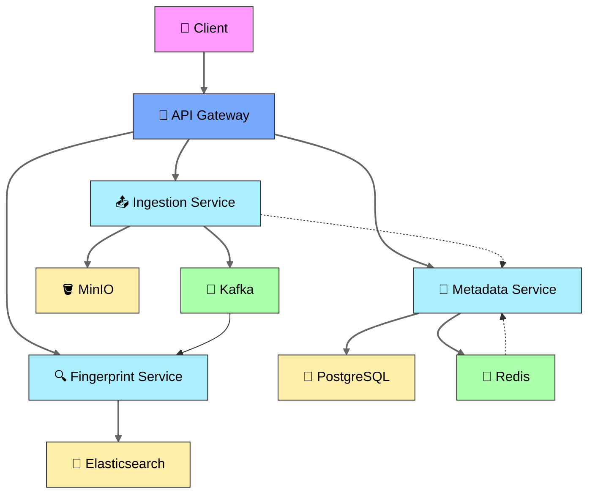

# 🎵 Audio Recognition System (Shazam-like) 🎶


## Table of Contents
- [Technology Stack](#-technology-stack)
- [System Components](#-system-components)
- [Prerequisites](#-prerequisites)
- [Quick Start](#-quick-start)
- [API Documentation](#-api-documentation)
- [Environment Variables](#-environment-variables)
- [Service Architecture](#-service-architecture)
- [License](#-license)

## 🚀 Technology Stack

**Core Components:**
- ☕ Java 17
- 🌱 Spring Boot 3
- ☁️ Spring Cloud
- 🐳 Docker Compose

**Data Layer:**
- 🐘 PostgreSQL (Metadata)
- 🔴 Redis (Caching)
- 🔍 Elasticsearch (Fingerprints)

**Infrastructure:**
- 📨 Apache Kafka (Events)
- 🗄️ MinIO (Audio Storage)
- 📊 Kibana (Monitoring)

## 🏗 System Architecture




## 📦 System Components

| Service              | Port  | Description                          |
|----------------------|-------|--------------------------------------|
| Gateway Service      | 8081  | API Gateway                          |
| Service Registry     | 8761  | Eureka Discovery Server              |
| Config Service       | 8888  | Centralized Configuration            |
| Audio Ingestion      | 8000  | Audio Upload Processing              |
| Metadata Service     | 8010  | Track Metadata Management            |
| Fingerprint Service  | 8080  | Audio Fingerprint Matching           |

## ⚙️ Supporting Services

| Service       | Port  | Description                |
|--------------|-------|----------------------------|
| PostgreSQL   | 5432  | Metadata Storage           |
| Redis        | 6379  | Caching                    |
| MinIO        | 9000  | Audio File Storage         |
| Kafka        | 9092  | Event Streaming            |
| Elasticsearch| 9200  | Fingerprint Storage        |
| Kibana       | 5601  | Monitoring Dashboard       |

## 📋 Prerequisites

- Docker 20.10+
- Docker Compose 2.0+
- 8GB+ RAM recommended

## 🚀 Quick Start

1. **Clone the repository**:
```bash
git clone https://github.com/BogdanPryadko4853/audio-shazam.git
cd audio-shazam
```

2. **Start all services**:
```bash
docker-compose up -d
```

3. **Verify services are running**:
```bash
docker-compose ps
```

## 📚 API Documentation

All APIs are available through the Gateway:

### 🎵 Ingestion Service
```
POST /api/v1/audio     - Upload audio file
GET  /api/v1/audio/{id} - Get audio metadata
```

### 📝 Metadata Service
```
GET    /api/v1/tracks      - List all tracks
POST   /api/v1/tracks      - Create track metadata
GET    /api/v1/tracks/{id} - Get track details
```

### 🔍 Fingerprint Service
```
POST /api/v1/fingerprints/search - Search by audio sample
GET  /api/v1/fingerprints/{id}   - Get fingerprint details
```

## 🔧 Environment Variables

Key configuration options:
```ini
# Database Configuration
SPRING_DATASOURCE_URL=jdbc:postgresql://db:5432/audio_metadata
SPRING_DATASOURCE_USERNAME=audio_admin
SPRING_DATASOURCE_PASSWORD=securepass

# Storage Configuration
MINIO_ENDPOINT=http://minio:9000
MINIO_ACCESS_KEY=minioadmin
MINIO_SECRET_KEY=minioadmin
MINIO_BUCKET=audio-bucket

# Messaging Configuration
SPRING_KAFKA_BOOTSTRAP_SERVERS=kafka:9092
```

### 💡 Access Points
- **API Gateway**: `http://localhost:8081`
- **Swagger UI**: `http://localhost:8081/swagger-ui.html`
- **MinIO Console**: `http://localhost:9001` (credentials: minioadmin/minioadmin)
```

