# 🎵 Audio Recognition System (Shazam-like) 🎶


## Table of Contents
- [Technology Stack](#-technology-stack)
- [System Components](#-system-components)
- [Prerequisites](#-prerequisites)
- [Quick Start](#-quick-start)
- [API Documentation](#-api-documentation)
- [Environment Variables](#-environment-variables)
- [Service Architecture](#-service-architecture)
- [License](#-license)

## 🚀 Technology Stack

**Core Components:**
- ☕ Java 17
- 🌱 Spring Boot 3
- ☁️ Spring Cloud
- 🐳 Docker Compose

**Data Layer:**
- 🐘 PostgreSQL (Metadata)
- 🔴 Redis (Caching)
- 🔍 Elasticsearch (Fingerprints)

**Infrastructure**:
- 📨 Apache Kafka (Events)
- 🗄️ MinIO (Audio Storage)

**Observability Stack**:
- 📊 Prometheus (Metrics)
- 🔍 Zipkin (Distributed Tracing)
- 📈 Grafana (Visualization)

🪵 ELK (Logging: Elasticsearch + Logstash + Kibana)

## 🏗 System Architecture

```mermaid
graph TD
    %% ========== Clients Section ==========
    A[<font color="#000000">📱 Client</font>] --> B[<font color="#000000">🚪 API Gateway</font>]
    
    %% ========== Main Services Section ==========
    subgraph "<font color="#000000">Microservices Layer</font>"
        B --> C[<font color="#000000">📤 Ingestion Service</font>]
        B --> D[<font color="#000000">📝 Metadata Service</font>]
        B --> E[<font color="#000000">🔍 Fingerprint Service</font>]
    end
    
    %% ========== Data Stores Section ==========
    subgraph "<font color="#000000">Data Layer</font>"
        F[<font color="#000000">🪣 MinIO</font>]
        G[<font color="#000000">📨 Kafka</font>]
        H[<font color="#000000">🐘 PostgreSQL</font>]
        J[<font color="#000000">🔴 Redis</font>]
        I[<font color="#000000">🔎 Elasticsearch</font>]
    end
    
    %% ========== Observability Section ==========
    subgraph "<font color="#000000">Observability</font>"
        subgraph "<font color="#000000">Metrics</font>"
            K[<font color="#000000">📊 Prometheus</font>]
            L[<font color="#000000">📈 Grafana</font>]
        end
        
        subgraph "<font color="#000000">Tracing</font>"
            M[<font color="#000000">🔍 Zipkin</font>]
        end
        
        subgraph "<font color="#000000">Logging</font>"
            N[<font color="#000000">🪵 Logstash</font>]
            O[<font color="#000000">📄 Elasticsearch</font>]
            P[<font color="#000000">📊 Kibana</font>]
        end
    end
    
    %% ========== Service Connections ==========
    C --> F
    C --> G
    D --> H
    D --> J
    E --> I
    G --> E
    
    %% ========== Observability Connections ==========
    C & D & E -->|<font color="#000000">Metrics</font>| K
    K --> L
    
    C & D & E -->|<font color="#000000">Traces</font>| M
    
    C & D & E -->|<font color="#000000">Logs</font>| N
    N --> O
    O --> P
    
    %% ========== Styling ==========
    classDef client fill:#f9f,stroke:#333,stroke-width:2px,color:#000000;
    classDef gateway fill:#7af,stroke:#333,stroke-width:2px,color:#000000;
    classDef service fill:#aef,stroke:#333,stroke-width:2px,color:#000000,rx:5,ry:5;
    classDef storage fill:#fea,stroke:#333,stroke-width:2px,color:#000000;
    classDef queue fill:#afa,stroke:#333,stroke-width:2px,color:#000000;
    classDef metrics fill:#f88,stroke:#333,stroke-width:2px,color:#000000;
    classDef tracing fill:#8f8,stroke:#333,stroke-width:2px,color:#000000;
    classDef logging fill:#88f,stroke:#333,stroke-width:2px,color:#000000;
    classDef cluster fill:none,stroke-dasharray:5,stroke:#aaa,color:#000000;
    
    class A client;
    class B gateway;
    class C,D,E service;
    class F,H,I,O storage;
    class G,J queue;
    class K,L metrics;
    class M tracing;
    class N,P logging;
    
    %% ========== Layout Improvements ==========
    linkStyle 0 stroke:#666,stroke-width:2px;
    linkStyle 1,2,3 stroke:#666,stroke-width:2px;
    linkStyle 4,5,6,7,8 stroke:#666,stroke-width:2px;
    linkStyle 9,10,11 stroke:#666,stroke-width:2px;
    linkStyle 12,13,14 stroke:#666,stroke-width:2px;
    linkStyle 15,16 stroke:#666,stroke-width:2px;
    
    %% Group styling
    class microservices,data,observability cluster;
```




## 📦 System Components

| Service              | Port  | Description                          |
|----------------------|-------|--------------------------------------|
| Gateway Service      | 8081  | API Gateway                          |
| Service Registry     | 8761  | Eureka Discovery Server              |
| Config Service       | 8888  | Centralized Configuration            |
| Audio Ingestion      | 8000  | Audio Upload Processing              |
| Metadata Service     | 8010  | Track Metadata Management            |
| Fingerprint Service  | 8080  | Audio Fingerprint Matching           |

## ⚙️ Supporting Services

| Service        | Port  | Description                          |
|---------------|-------|--------------------------------------|
| PostgreSQL    | 5432  | Metadata Storage                     |
| Redis         | 6379  | Caching                              |
| MinIO         | 9000  | Audio File Storage                   |
| Kafka         | 9092  | Event Streaming                      |
| Elasticsearch | 9200  | Fingerprint Storage & Logging        |
| Kibana        | 5601  | Monitoring & Log Dashboard           |
| Prometheus    | 9090  | Metrics Collection                   |
| Grafana       | 3000  | Metrics Visualization                |
| Zipkin        | 9411  | Distributed Tracing                  |
| Logstash      | 5044  | Log Processing                       |

## 🔍 Observability Endpoints

| Service     | URL                          | Credentials             |
|-------------|------------------------------|-------------------------|
| Prometheus  | http://localhost:9090        | -                       |
| Grafana     | http://localhost:3000        | admin/grafana           |
| Zipkin      | http://localhost:9411        | -                       |
| Kibana      | http://localhost:5601        | -                       |

## 📋 Prerequisites

- Docker 20.10+
- Docker Compose 2.0+
- 12GB+ RAM recommended (with full observability stack)
- At least 4 CPU cores
## 🚀 Quick Start

1. **Clone the repository**:
```bash
git clone https://github.com/BogdanPryadko4853/audio-shazam.git
cd audio-shazam
```

2. **Start all services**:
```bash
docker-compose up -d
```

3. **Verify services are running**:
```bash
docker-compose ps
```

## 📚 API Documentation

All APIs are available through the Gateway:

### 🎵 Ingestion Service
```
POST /api/v1/audio     - Upload audio file
GET  /api/v1/audio/{id} - Get audio metadata
```

### 📝 Metadata Service
```
GET    /api/v1/tracks      - List all tracks
POST   /api/v1/tracks      - Create track metadata
GET    /api/v1/tracks/{id} - Get track details
```

### 🔍 Fingerprint Service
```
POST /api/v1/fingerprints/search - Search by audio sample
GET  /api/v1/fingerprints/{id}   - Get fingerprint details
```

## 🔧 Environment Variables

Key configuration options:
```ini
# Database Configuration
SPRING_DATASOURCE_URL=jdbc:postgresql://db:5432/audio_metadata
SPRING_DATASOURCE_USERNAME=audio_admin
SPRING_DATASOURCE_PASSWORD=securepass

# Storage Configuration
MINIO_ENDPOINT=http://minio:9000
MINIO_ACCESS_KEY=minioadmin
MINIO_SECRET_KEY=minioadmin
MINIO_BUCKET=audio-bucket

# Messaging Configuration
SPRING_KAFKA_BOOTSTRAP_SERVERS=kafka:9092
```

### 💡 Access Points
- **API Gateway**: `http://localhost:8081`
- **Swagger UI**: `http://localhost:8081/swagger-ui.html`
- **MinIO Console**: `http://localhost:9001` (credentials: minioadmin/minioadmin)
```

